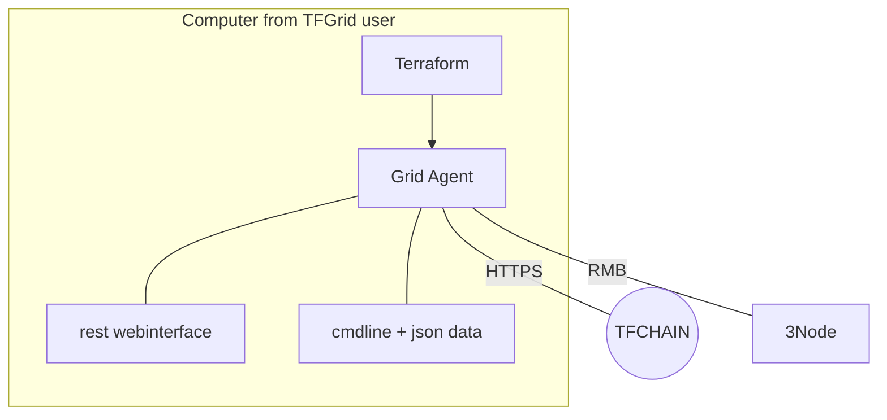
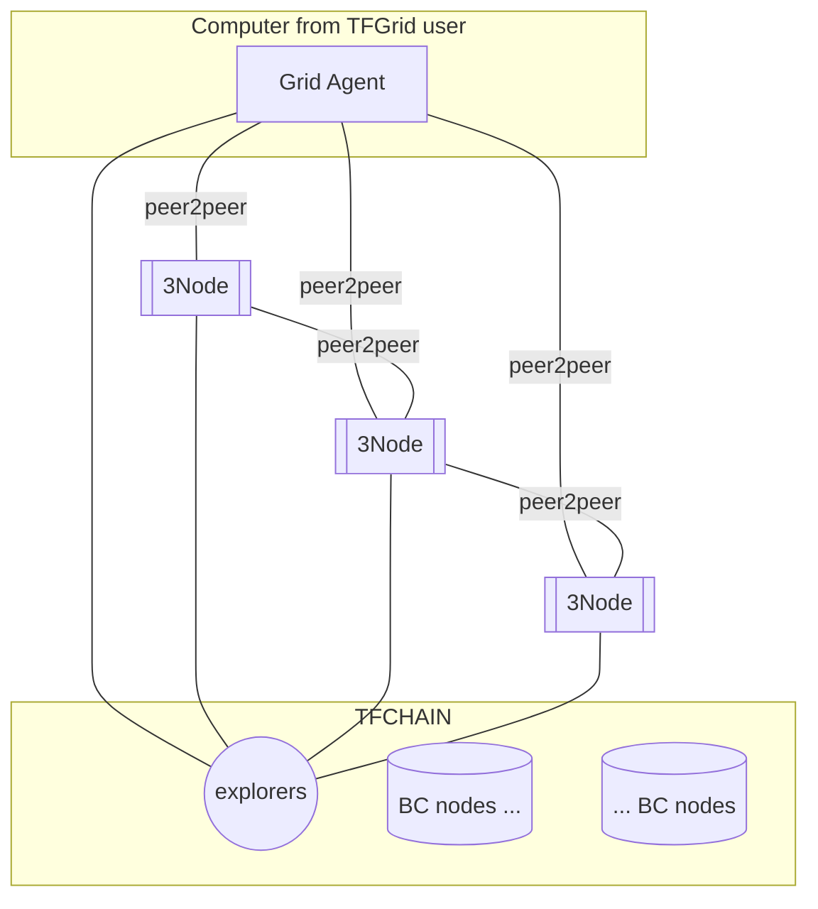

An grid_agent works on behalf of user and talks to the TFChain and to the different 3Nodes.

grid_agent is the connection point for the developer.

Functions of the grid_agent

- blockchain client to TFChain
- wallet using TFChain TFT
- rest interface to allow developer to deploy tfgrid_primitives
- signing/encryption primitives as needed
- interface to RMB
- type checking for strongly typed structs as needed on TFGrid
- terraform plugin
  
> implemented as part of twin_server

All peer2peer traffic is using RMB.
