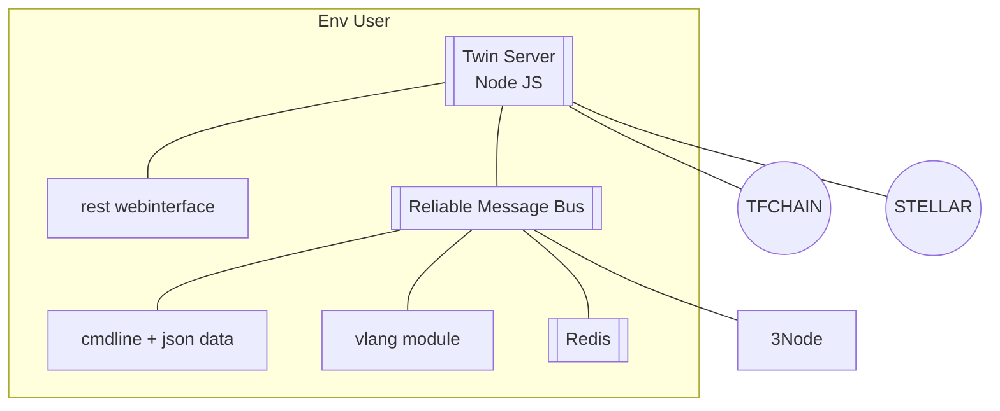

# Twin Server

- twin_server is implemented in nodejs

> TODO: use gitpod to run env as specified here, all need to run inside, easy to develop

## More Info

- [twin_server_tech](twin_server_tech)
  

!!!def alias:twin_server,digital_twin_server,digital_self_server,self_server