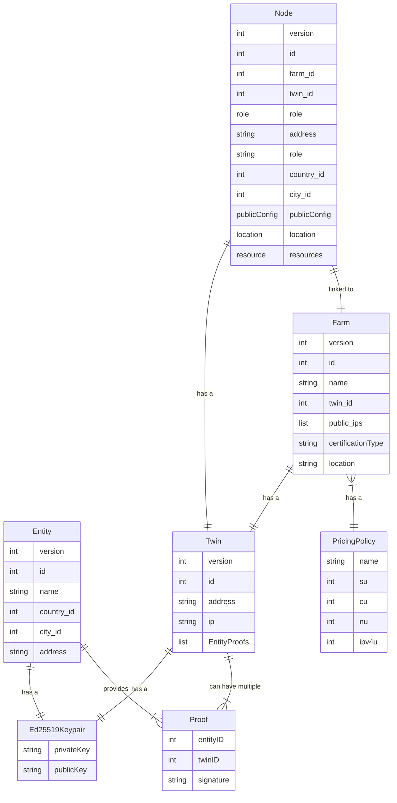

```mermaid
erDiagram
    Entity {
        int version
        int id
        string name
        int country_id
        int city_id
        string address
    }
    Entity ||--|| Ed25519Keypair : "has a"
    Entity ||--|{ Proof : provides
    Twin {
        int version
        int id
        string address
        string ip
        list EntityProofs
    }
    Farm ||--|| Twin : "has a"
    Node ||--|| Twin : "has a"
    Twin ||--|| Ed25519Keypair : "has a"
    Twin ||--|{ Proof : "can have multiple"
    Ed25519Keypair {
        string privateKey
        string publicKey
    }
    Proof {
        int entityID
        int twinID
        string signature
    }
    Farm {
        int version
        int id
        string name
        int twin_id
        list public_ips
        string certificationType
        string location
    }
    Farm }|--|| PricingPolicy : "has a"
    Node {
        int version
        int id
        int farm_id
        int twin_id
        role role
        string address
        string role
        int country_id
        int city_id
        publicConfig publicConfig
        location location
        resource resources
    }
    PricingPolicy {
        string name
        int su
        int cu
        int nu
        int ipv4u
    }
    Node ||--|| Farm : "linked to"
```